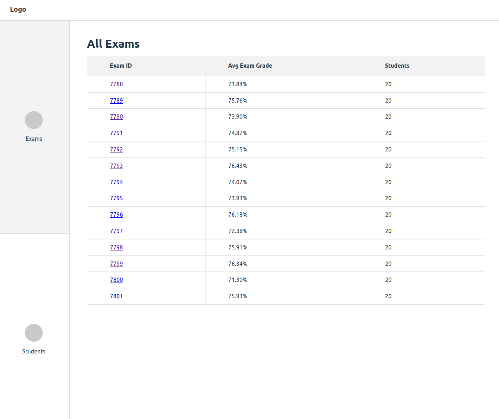
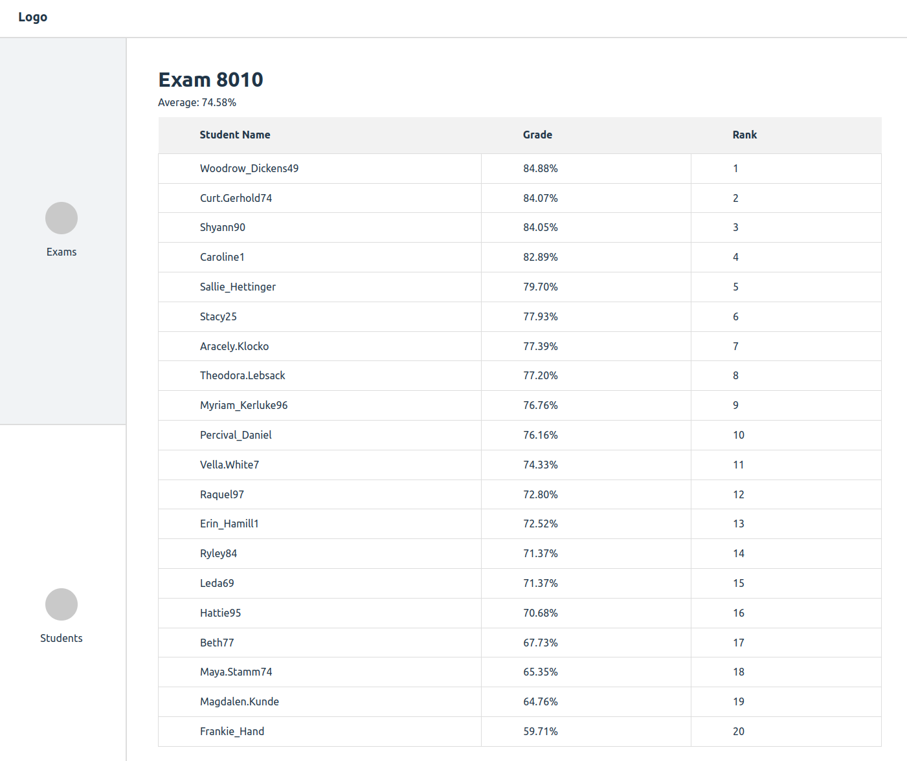
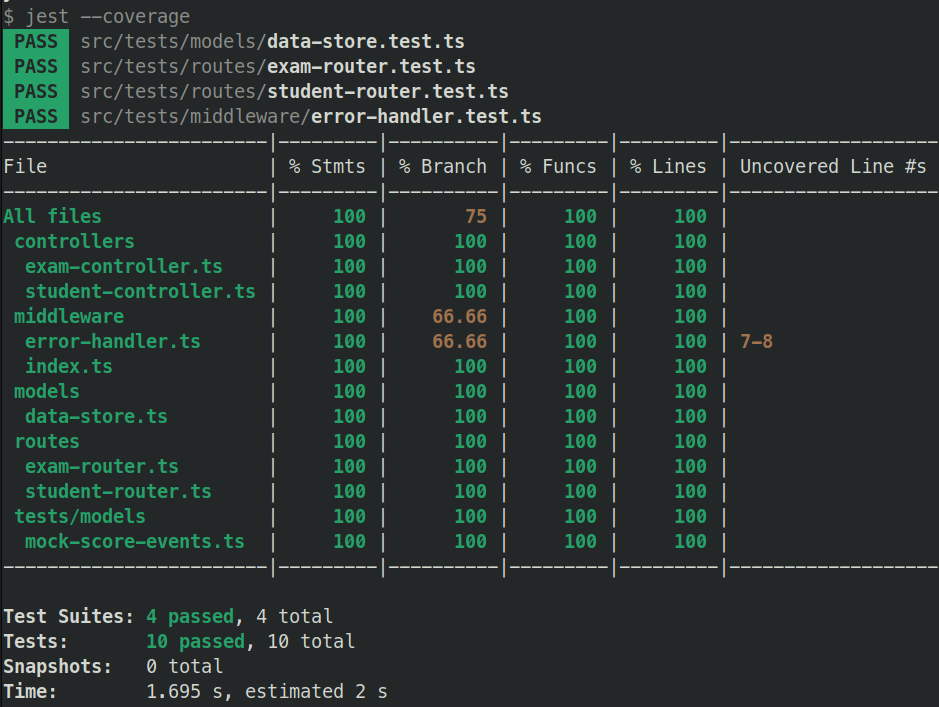

# LD Assessment

# Setup

Run `yarn` in the monorepo root to install dependencies for both workspaces.

# Run

1. Start the server with `yarn dev` inside the backend directory.
2. Start the frontend with `yarn dev` inside the frontend directory.

# Test

- Backend tests can be run with `yarn test`.

# Notes

- Using react-router-dom on the frontend.
- Did not get to frontend tests in the 3 hr time frame.
- If the frontend is not on the default port then you will need to add it to the backend whitelist for CORS.
- The backend url can also be provided via `.env` file with the `VITE_BACKEND_URL` key.

### Backend REST API

1. `/students` lists all users that have received at least one test score
2. `/students/{id}` lists the test results for the specified student, and provides the student's average score across all exams
3. `/exams` lists all the exams that have been recorded
4. `/exams/{number}` lists all the results for the specified exam, and provides the average score across all students

# Some screens

